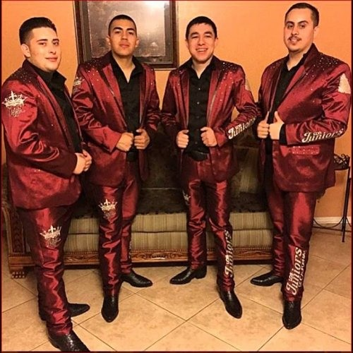

# Miguel Angel Lara Chavez

## About Me
3rd year cs student at UCSD, originally from Soledad CA. My favorite part of learn the process of SWE so far is the security and backend aspects of SWE apart from school and work i like to play the accordion like **Miles Jones** 

## fav quote
> Entre lo bueno y lo malo mientras uno tenga vida
Solo pa delante damos
this translates to through the good in bad while we have life we keep going forward

## code
```java
public class Main {
    public static void main(String[] args) {
        System.out.println("ok mijo");
    }
}
```

## Links

[My GitHub](https://github.com/mig678)

[Go to About Me](#about-me)

[Look at README](README.md)



## My fav bands 

1. Los juniors de California (photo i uploaded)
2. Jr baraza
3. Los paranderos de chihuaha

## Tasks i did today

- [x] eat
- [x] go school
- [x] go work
- [ ] finish asignments